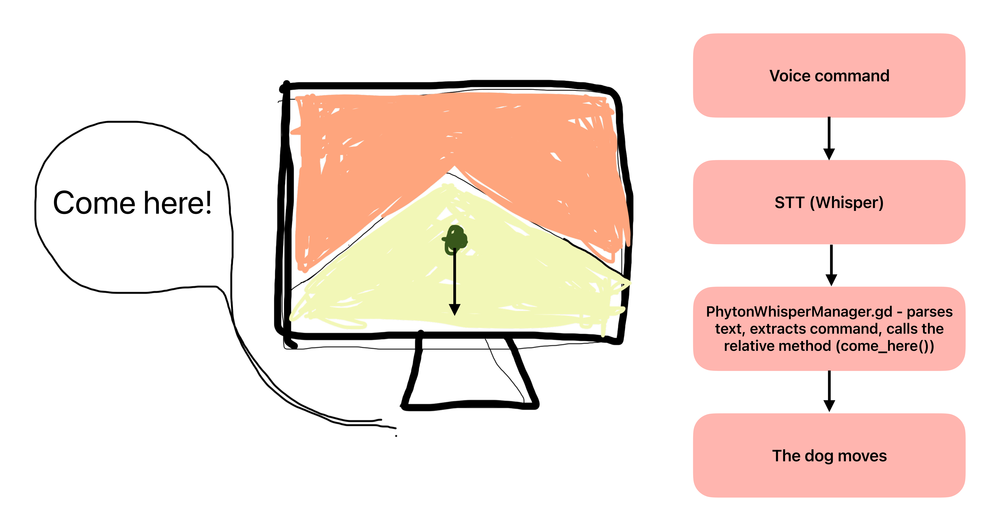

# 🐶 Project Bark 🐺

Project Bark is a concept game in which the player has a walk with a dog in a foirest, and guides the dog using voice commands. 

Core components:

- Engine: Godot 4.4
- STT: OpenAI Whisper

## Structure overview

## How to run the game

1. Set the voice server `conda activate bark && python audio_server.py` 🎙️
2. Start the game as usual using the Godot editor 

## Map input and output devices

- `test_audio_devices.py` to list the available devices
- `test_record_devices.py` to check that we can record audio

## Commands

The commands we can give to the dog are grouped in three tiers, with growing complexity:

- **Basic commands**: `come here`, `stay`, `sit`, `go` ✅
- **Intermediate commands**: `drop it`, `find it`, `get it`, `leave it`
- **Advanced commands**: `up`, `down`, `inside`
